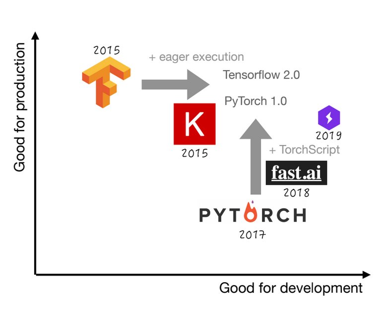

# Introduction to my notes

These are my notes from the [full-stack deep learning course](https://fullstackdeeplearning.com/).

They have a  focus on the GLAM setting, which might have different requirements, incentives and resources compared to business deployments of ML projects. These notes are for my use primarily. I am posting them to make myself more accountable for making semi-coherent notes.

**These are my notes, written in a personal capacity - my employer denounces all my views**

## The Dream 

The dream is to build a system that has a tight feedback loop between data -> model -> inference -> more data -> better model -> better predictions ...

One note here: this is a nice dream for some ml applications, but others might be more 'one-off tools' where this might be less important. For example, tools developed to help work with the ingest of a new collection.

## Infrastructure buckets

A bunch of tools that help get closer to this dream broadly fall into three categories 

| Data                 | Training                            | Deployment                  |
|----------------------|-------------------------------------|-----------------------------|
| Data Sources         | Compute                             | CI/CD                       |
| Databases            | Resource management                 | Testing                     |
| Data Version control | Frameworks for distributed training | Tooling for edge deployment |
| Labelling tools      | Experiment management               | Web deployment              |
| Feature stores       | Hyperparmater tuning                | monitoring                  |

There is a slightly overwhelming range of tools here. I think some of these only make sense at a certain level of scale, i.e. auto-scaling inference across multiple regions is probably not a scenario many (any?) glam institutions are dealing with at the moment for their ml pipelines. There are probably some notable exceptions here; internet archive, Wikipedia etc.

## Editors 

I fast forward through this bit as I'm mostly happy with my choices here!

## Compute needs 

Two primary compute needs: development and training/evaluation. 

The development one intended to make experimentation easy. Do basic training etc. 

Training compute: multi GPUs to do parameter sweeps etc. I think financial constraints often make this part less possible in a GLAM setting. There may also be some benefits to restricting compute slightly. Since GLAMs might (maybe should) be also considering how to share models approaches it migth not be helpful to immediately jump to models which require multiple GPUs to fine-train when a model with much more constrained resources might only be slightly worse. 

### Cloud vs local 

- Nvidia default for GPU
- New architecture every year: Kepler -> pascal -> volta -> turing -> ampere
- Server and then 'enthusiast', then consumer versions of the cards
- Business only supposed to use primarily server cards. I don't know what the definition of business is here, but it seems this is reguarly ignored 

A note here; I think a lot of use cases for deep learnings in GLAMs could probably be addressed with a dev box with one 3090 card and a bunch of storage. This may also be slightly less annoying for IT compared to going into the cloud.

The cost of cloud gets expensive compared to local deep learning rig. 

Spot instances can make things cheaper. Can be fine for doing experiments in parallel and time saving is important.

On prem scaling can be challenging at some points. For a Glam lab setting having one/two GPUs still seems prefferable for 'local work' there might also be a desire to facilate access to collections for researhcers etc which may work better through the cloud. 

### Resource management 

Managing environments, resources

- could use simple scripts to manage this 
- slurm for scheduling jobs
- docker - will come up later in the course
- 'all in one solutions' - possibly overkill 

## Frameworks

Deep learning frameworks put on a chart with good for production and good for development chart. 

I think in the context of using deep learning in a GLAM setting, there should be a lot of emphasis placed on using frameworks that focus on making things easier to understand for a broader audience. I think GLAMs should be trying to upskill a wide range of staff with some of the skills associated with ml and a core of staff with the skills to develop all/some/most things themselves as *domain experts*. For this, to work, I there needs to be an emphasis placed on the accessibility of model development. i.e. prefer to use a framework training loop (fastai/Keras/lightning) rather than roll a custom loop since this probably won't add much but will often make code harder for others to understand. 

## Experiment tracking

Deep learning usually involves at least some experimentation with different model architectures, data augmentations, hyper parameters etc. Keeping track of this can be a pain to do manually. 

Various options are available. Weights and Biases seem to be the most liked commercial offering. There are a bunch of open source projects that do this too.

## Hyperparameter Optimization

Various options for doing this, including local/open source offerings. 

Increasingly a move towards 'end-to-end' platforms for helping across the ml lifecycle. 

My take away from this lecture is that there can be an overwhelming range of tools available. Probably these tools should be introduced slowly into a workflow. From my perspective, the experiment tracking components should be a priority. 
