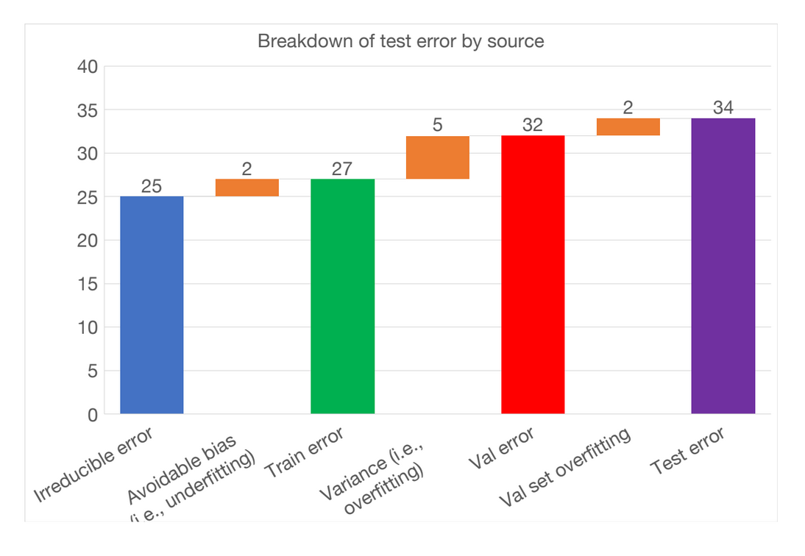

# Introduction to my notes

These are my notes from the [full-stack deep learning course](https://fullstackdeeplearning.com/).

They have a  focus on the GLAM setting, which might have different requirements, incentives and resources compared to business deployments of ML projects. These notes are for my use primarily. I am posting them to make myself more accountable for making semi-coherent notes.

**These are my notes, written in a personal capacity - my employer denounces all my views**

## Why talk about debugging?

80-90% of time spent on debugging? Useful to have some approaches for doing this work.

### Why is deep learning debugging hard?

#### Small implementation details 
Often you may get an error that results in weird results but the code still runs. You don't have an exception to help you debug. Often need to manually dig around to find the cause of the error. Example:

```python
images = glob.glob('path/to/images/*')
labels = glob.glob('path/to/labels/*')
```
Will not return images and labels in the correct order because of how glob is implemented in python. This doesn't throw an error but the model won't learn anything. 

#### Hyperparamers
Small changes to hyperparameters can make the difference between model training well and not training at all. 

#### Data/Model fit 

Performance on model on one set of images i.e. imagenet might not translate to the data you are working with. Transfer learning will often help but it might be unclear exactly how the model/new tasks translate to new types of data/problems. 
#

#### Models vs Dataset construction


In an academic setting, a lot of thought is given to choosing models/algorithms. Often this is less of a focus when deploying machine learning in a production setting where there will be many more challenges around constructing a dataset. 


Notes: I think there is a shift here is going from training n a validation/training set to having in the back of your head that predictions will be made 'in the wild'. 

There can be a fair bit of variation in GLAM datasets which also potentially makes data drift hard to track 


### Architecture Selection 

It can be overwhelming to pick between all the different types of model architectures. Suggestion to start out with a few different flavour and change if needed:

| Type      | Model                                             |   Maybe move to?    |
|-----------|--------------------------------------------------|-----------|
| Images    | LeNet-like model                                 | ResNet    |
| Sequences | LSTM with one hidden layer                       | Attention |
| other     | Fully connected neural net with one hidden layer | Problem dependent          |


### Sensible defaults
version zero of your model could start with:

- optimizer: Adam with learning rate 3e-4
- activations: relu  (FC and Convultional models), tanh (LSTMS)
- Intitilization: He et al. normal(relu), GLorot normal (tanh)
- Regulirization: none 
- data normalization: none

### Consider simplifying the problem

- start with a subset of the training data 
- use a fixed number of objects, classes etc. 
- create a simpler synthetic training set 

### Model evaluation 

tl;dr apply bias-variance decomposition 



> In statistics and machine learning, the bias-variance tradeoff is the property of a model that the variance of the parameter estimates across samples can be reduced by increasing the bias in the estimated parameters. The bias-variance dilemma or bias-variance problem is the conflict in trying to simultaneously minimise these two sources of error that prevent supervised learning algorithms from generalising beyond their training set:[1][2]
>  The bias error is an error from erroneous assumptions in the learning algorithm. High bias can cause an algorithm to miss the relevant relations between features and target outputs (underfitting).
>    The variance is an error from sensitivity to small fluctuations in the training set. High variance can cause an algorithm to model the random noise in the training data rather than the intended outputs (overfitting). \
> [https://en.wikipedia.org/wiki/Bias%E2%80%93variance_tradeoff]()

- Test error = irreducible error + bias + variance + val overfitting

Here we try and see the difference in error between our training data and some kind of baseline, i.e. human performance, to see how much we are underfitting. We also compare validation to training to see how much overfitting. 

This assumes training, validation, and test come from the same distribution.

Notes: tracking the impact of distribution shift on model performance helpful here. 

Example 

| Error source     | value |
|------------------|-------|
| Goal             | 1%    |
| Train error      | 20%   |
| Validation error | 27%   |
| Test error       | 28%   |

- The difference between our goal and our train error shows underfitting 
- The difference between train and validation also shows we're also overfitting
- test and validation error difference is okay 

🤷‍♂️ Both overfitting and underfitting - how to decide what to do next...


### prioritizing improvements

It seems hard to both deal with under and overfitting. The suggested process is to follow the following steps:

1) address underfitting
2) address overfitting
3) address distribution shift
4) re-balance data (if applicable)

### How to address under-fitting (i.e. reduce bias)

These suggestions are listed in order of what to try first.

- Make the model bigger (i.e. resnet34, to resnet50)
- reduce regulirization 
- error analysis 
- choose different model architecture (i.e. bump from LeNet to ResNet). This can introduce new problems, so be careful here
- add features 😬 sometimes this can really help even in deep-learning 

### Addressing over-fitting

- add more training data (if possible)
- add normalisation 
- data augmentation 
- regularisation 
- error analysis 
- choose better model architecture
- tune hyperparameters
- early stopping
- remove features
- reduce model size

### Addressing distribution shift

a) analyse test-val set errors - why might these errors be there in the validation set. 
b) analyse test-val set errors and synthesise more data 
c) domain adaptation 

### Error analysis

Try and find the different sources of error in test/val and see how easily they can be fixed + how much they contribute to the error.

This could be particularly important when domain expertise might help track down why some of these errors occur. This might also be used to reevaluate labels being targeted if they often cause confusion. Fastai has some nice methods for this `most_confused` to show which labels are often confused. If this confusion is reasonable, you may a) either not care too much about these mistakes b) collapse two labels into one label. 

### Domain adaptation 
- supervised: fine-tune pre-trained model 
- un-supervised: more in the research domain at the moment? 

## Tuning Hypermaters

Model and optimiser choices?
- how many layers
- kernel size
- etc. 


How to choose what to tune? some hyperparameters are more essential but its often hard to know which are going to be more important

rules of thumb of what is worth tuning

| Hyperparamter              | likely senstivity        |
|----------------------------|--------------------------|
| Learning rate              | high                     |
| Learning rate schedule     | high                     |
| Optimiser choice           | low                      |
| other optimiser parameters | low                      |
| batch size                 |  low (what fits onto GPU) |
| weight initialisation | medium                   |
| loss function              | high                     |
| model depth                | medium                   |
| layer size                 |  high                     |
| layer params               | medium                   |
| Weight of regularisation | medium                    |
| nonlinearity             | low                      |


    
### Approaches to hyperparameters

#### Manual:
- focus on what is likely to make a difference conceptually
- train and evaluate model
- guess a better parameters
- can be good as a starting point + combined with other approaches


#### Grid search
- easy to implement 
- but expensive and you need to have a good sense of sensible range points

#### Random search 
- often better than grid search for the same number of runs
- not very easy to interpret 

#### Bayesian approaches

- There are nice frameworks for doing this
- generally most efficient t
- can be hard to implement 

## Overarching notes
personally, I think some of these suggestions might be better suited in settings where ml will be the product/service. In GLAMS, this might sometimes be the case, but there is also low hanging fruit using ml as a 'tool'. In this case, I think it might make more sense to start with the proper implementation of ResNet as a starting point rather than coding your own net from scratch. 

The discussion on error analysis was excellent and is a valuable framework for working out how to prioritise improvements. 
