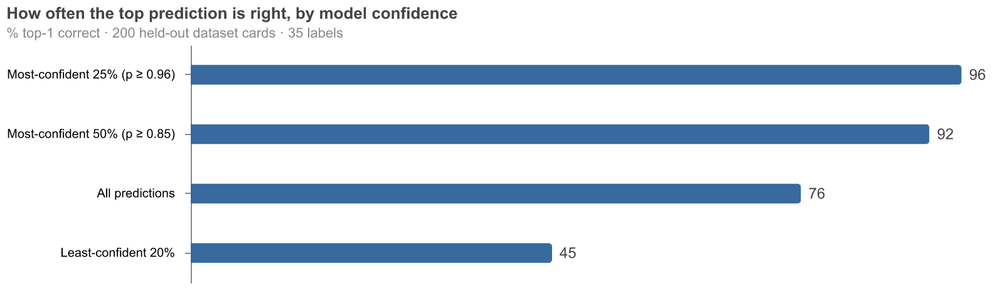

This week LiquidAI released [LFM2.5-Encoders](https://huggingface.co/blog/LiquidAI/lfm2-5-encoders). They're small bidirectional encoders (230M and 350M) that they report beating ModernBERT-base on GLUE/SuperGLUE, with an 8,192-token context. Since I'm still excited about smaller models that are very fast and cheap to run I wanted to see how this new encoder would do. I have had a previous idea of using the Hub's `task_categories` metadata to train a classifier that could suggest task categories for datasets that don't declare any, so I thought I'd try that.

What I actually did was paste the blog post and their cookbook repo into Claude Code and say, more or less: *turn this into a recipe for my [uv-scripts collection](https://github.com/davanstrien/uv-scripts-for-ai), and smoke-test it on [Jobs](https://huggingface.co/docs/hub/jobs-overview) early, before polishing anything*. Then I answered questions when asked and checked in occasionally.

## What came back

By the evening there was:

- **A recipe**: [`train-classifier.py`](https://huggingface.co/datasets/uv-scripts/classification/blob/main/train-classifier.py) — one self-contained file that fine-tunes an encoder on any Hub dataset and pushes the trained model back to the Hub. Single-label and multi-label, auto-detected from the label column. Defaults to the new LFM2.5 encoder but takes any encoder via `--model`.
- **A tutorial dataset**: [dataset-cards-with-task-categories](https://huggingface.co/datasets/davanstrien/dataset-cards-with-task-categories) — 21k Hub dataset cards labelled with their `task_categories` metadata. A nicely self-referential task: predict a dataset's task categories from its card's prose.
- **A working model**: [dataset-card-task-classifier](https://huggingface.co/davanstrien/dataset-card-task-classifier), trained in 20 minutes on an A100 for about $0.80.

The whole thing reproduces with one command:

```bash
hf jobs uv run --flavor a100-large --secrets HF_TOKEN \
  https://huggingface.co/datasets/uv-scripts/classification/raw/main/train-classifier.py \
  davanstrien/dataset-cards-with-task-categories your-username/card-task-classifier \
  --label-column labels --max-length 1024 --batch-size 32
```

The model isn't a benchmark result — micro-F1 0.69 across 35 labels — but it has one property I care about: its confidence is honest.



That's the shape you want for the obvious application: suggesting `task_categories` for the roughly two-thirds of Hub datasets that don't declare any, auto-applying only the confident ones, and sending the rest to a human. The label set is capped to the task categories that actually work as filters on [hf.co/datasets](https://huggingface.co/datasets), so every suggestion is a real, filterable tag.

::: {.callout-note appearance="simple"}
Everything in this post is public: the [recipe](https://huggingface.co/datasets/uv-scripts/classification) (part of [uv-scripts](https://huggingface.co/uv-scripts), source on [GitHub](https://github.com/davanstrien/uv-scripts-for-ai)), the [tutorial dataset](https://huggingface.co/datasets/davanstrien/dataset-cards-with-task-categories), and the [trained model](https://huggingface.co/davanstrien/dataset-card-task-classifier).
:::

## What the smoke tests caught

The agent's smoke tests caught two real bugs I doubt I'd have found faster myself: a transformers v5 crash when a custom classification head doesn't declare its config class, and a genuinely sneaky `datasets` behaviour where writing encoded labels back into a same-named column silently casts them to the *original* column's schema — multi-hot floats became strings, and training fell over. It also caught the trap in the tutorial data: dataset cards *contain* their own `task_categories` in the YAML frontmatter, so training on raw cards would have been label leakage. The frontmatter gets stripped, and rows that still leak get dropped.

None of that is heroic. It's the ordinary debugging you'd do yourself — the point is that each iteration was a ~$0.25, ten-minute GPU job away, so the agent could just *run* the thing instead of reasoning about whether it would work.

This worked because the infrastructure is legible to agents: every recipe in the collection is a single file that runs from a URL with the same `input output` argument shape; Jobs gives a disposable GPU with a cost cap and no environment to break; the Hub is the filesystem on both ends. I steered — precision over recall, which label taxonomy to target, where the recipe should live — and reviewed the results. The agent did the typing, the debugging, and the waiting.

Total GPU spend, including every failed smoke test and a full retrain after I changed my mind about the labels: under $5.

## Try it with your own agent

If you want the same loop on your own data, you don't need to write anything — hand your agent a prompt along these lines:

```
I want to train a text classifier using LiquidAI's LFM2.5 encoder on
Hugging Face Jobs.

- First run `hf --help` and `hf jobs --help` to learn the CLI, and check
  I'm logged in with `hf auth whoami`.
- Read the base model's card with
  `hf models card LiquidAI/LFM2.5-Encoder-350M` so you know its context
  length and languages.
- Use this uv-scripts recipe as the starting point — read its docstring
  before running anything:
  https://huggingface.co/datasets/uv-scripts/classification/raw/main/train-classifier.py
- Ask me which Hub dataset I want to train on, then inspect it and
  confirm the text and label columns with me (single- and multi-label
  are auto-detected from the label column).
- Run a cheap smoke test first (--max-samples 1000 --epochs 1 on
  a10g-small), show me the metrics from the job logs, and ask before
  launching the full run.
- When the full run finishes, read the pushed model's card with
  `hf models card <output-repo>` and give me the link plus a summary of
  the eval metrics.
```

The recipe's docstring carries the rest — flavors, long-context flags, and what the pushed model card contains.
