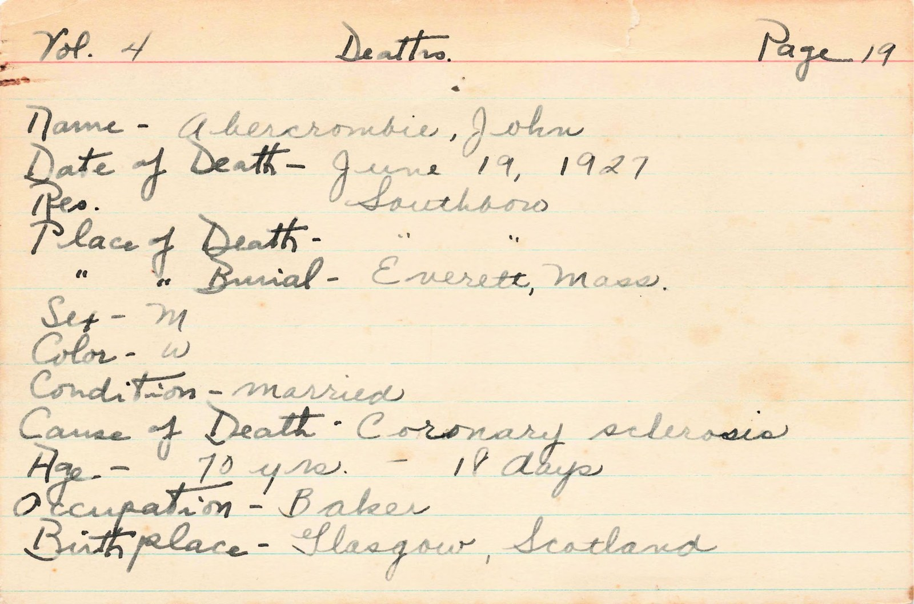
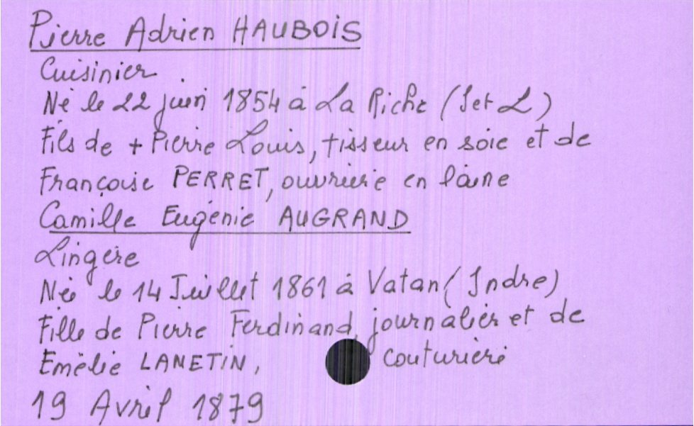
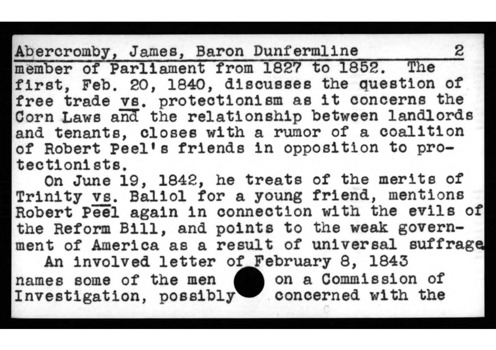
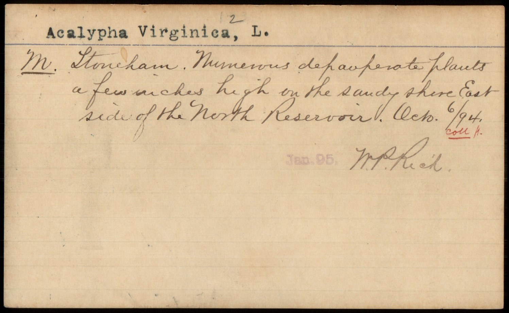
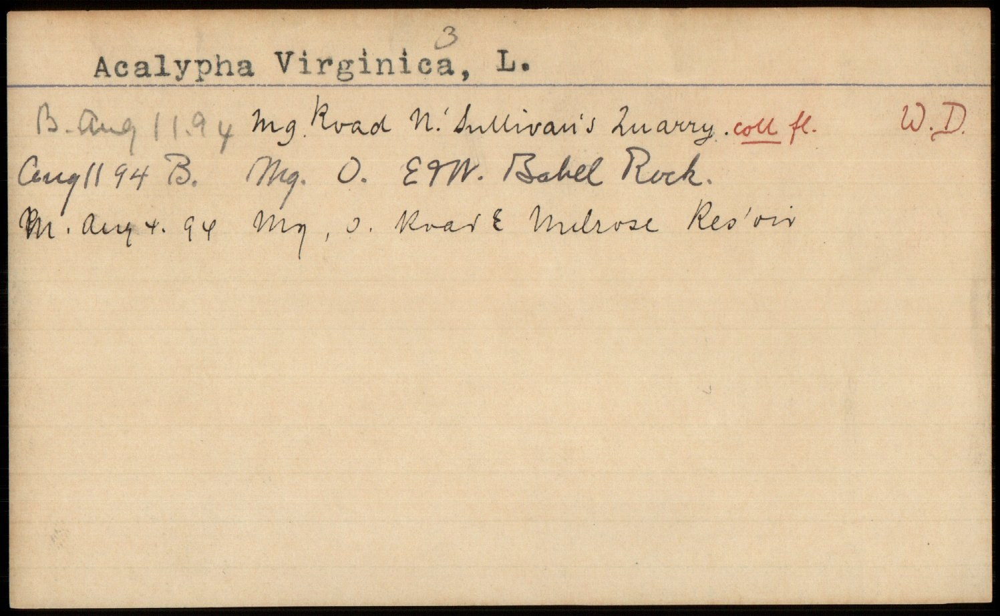
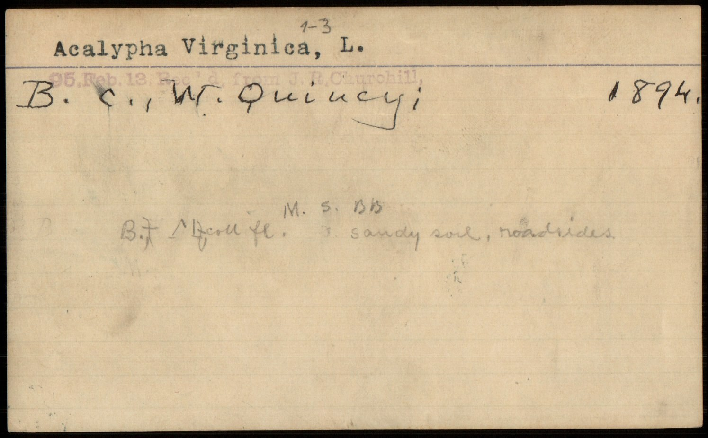

> **Draft for review.** Numbers are from held-out test sets; small test sets are flagged as such. Model + open datasets staged, not yet released.

::: {.callout-note}

## OCR or structured extraction?

VLM based OCR models have got much better in the past year or so but there are many cases where you actually want some structured data from a document stored as an image (i.e. non machine readable). This use case is relevant in many domains. In the GLAM (Galleries, Libraries, Archives, Museums) sector, many collections are stored as images of index cards. Many of these are still not in other systems and the only source of this information is the card itself. The same is true in other domains, for example in natural history collections where specimen cards are still used to store information about a specimen. In these cases, you want to extract structured data from the card image, not just the text.

## NuExtract-3

[NuExtract-3](https://huggingface.co/numind/NuExtract3) takes an **image** plus a **schema** (the list of fields you want) and hands back **JSON** — no bounding boxes, no layout rules, no separate OCR step. Here is one card and the record that comes back:

{width=60%}

```json
{
  "name": "Abercrombie, John",
  "date_of_death": "June 19, 1927",
  "cause_of_death": "Coronary sclerosis",
  "age": "70 yrs. - 18 days",
  "occupation": "Baker",
  "birthplace": "Glasgow, Scotland",
  "place_of_burial": "Everett, Mass."
}
```

Everything below is about making that one trick much better on a specific collection — and keeping it good at working on collections it has never seen.
:::

A while back I showed that a 4B open model, [NuExtract-3](https://huggingface.co/numind/NuExtract3), could turn [catalogue-card images into structured JSON](../structured-records-from-cards/index.qmd) zero-shot — hand it an image and a schema, get a record back.

In that post I suggested the model is a very strong zero-shot model for a _first pass_ (and may be good enough in many cases) but the real win would **a small model fine-tuned for a specific collection**.

This post picks up on this topic. The question I wanted to answer: **can one cheap, open 4B model be fine-tuned to read _many_ different card collections very well — each with its own schema — without becoming a brittle specialist?** And if so, does it stay useful on collections it was never trained on?

The short version: **yes, and more than I expected.** One model now reads French _and_ English handwritten death records, English manuscript-catalogue cards, follows schemas it has never seen, and on the single most important field **beats the 8B model that generated some of its training labels** — all for about **$45** of compute, entirely on [Hugging Face Jobs](https://huggingface.co/docs/hub/jobs) (this compute includes a lot of me trying weird experiments so to just do the fine-tuning and evaluation would be way cheaper.)

## The collections

I trained and evaluated on three real archival collections, deliberately chosen to be _different_ from each other — different institutions, languages, layouts, and record types:

| collection                                                                                                  | what it is                                   | language                   | ground truth            |
| ----------------------------------------------------------------------------------------------------------- | -------------------------------------------- | -------------------------- | ----------------------- |
| [Teklia DAI-CReTDHI](https://huggingface.co/datasets/Teklia/DAI-CReTDHI-IndexCards-KIE)                     | vital-records index cards, Archives of Tours | French, handwritten        | expert (MIT)            |
| NLS Advocates Library                                                                                       | manuscript-catalogue cards                   | English, typed/handwritten | cataloguer-reviewed     |
| [Southborough vital records](https://huggingface.co/datasets/biglam/index-cards-southborough-vital-records) | town-clerk death cards (MA)                  | English, handwritten       | silver (model-labelled) |

Plus a fourth, the [Duke Rubenstein manuscript catalogue](https://huggingface.co/datasets/biglam/rubenstein-manuscript-catalog), held out entirely i.e. _never trained on_ to test whether the model follows a schema it wasn't trained on before (and if we broke the zero shot generality of the base model).

Three of the four, side by side — different institutions, languages, and layouts:

::: {layout-ncol=3}




:::

Each collection wants a _different shape_ of record. A death card has `name / date_of_death / cause / age / birthplace`; a manuscript card has `heading / heading_type / entries[ms_no, folios, ...]`. The model is told the schema at inference and fills it in — the same template mechanism NuExtract-3 ships with, just made better at _these_ materials.

## What domain adaptation buys you

Start with the hardest collection — Teklia's French handwriting. Zero-shot NuExtract-3 scores **0.24** field-F1.[^f1] After LoRA fine-tuning on ~430 cards (about 10 minutes, ~$2):

| Teklia (French handwritten deaths) | field-F1 |
| ---------------------------------- | -------- |
| NuExtract-3 zero-shot              | 0.24     |
| **+ fine-tuning**                  | **0.89** |

That jump — **0.24 → 0.89** is the pitch for small fine-tuned models. The model learns the routing, the role structure, and (easy to miss) the collection's _surface conventions_: how it writes dates, month names, and abbreviations. On the French cards that means the period's own shorthand — old forms like `Xbre` for _décembre_, or a surname written first in capitals — exactly the kind of detail a zero-shot model has to guess at and a fine-tuned one simply learns. Cheaply, on one consistent card series, you go from "interesting demo" to "genuinely usable first pass."

## One model, many schemas — for free

The interesting question is whether you can fold _several_ collections into **one** model without it forgetting the others. It seems you can. Training a single model on all three collections at once:

| collection               | metric    | single-collection | **one generalist model** | external reference    |
| ------------------------ | --------- | ----------------- | ------------------------ | --------------------- |
| Teklia (FR deaths)       | field-F1  | 0.889             | **0.878**                | —                     |
| NLS (manuscripts)        | retrieval | —                 | **0.726**                | Qwen3-VL-8B 0.760     |
| NLS (manuscripts)        | ms_no F1  | —                 | **0.952**                | Qwen3-VL-8B **0.886** |
| Southborough (EN deaths) | macro-F1  | —                 | **0.750**¹               | new collection        |

¹ The Southborough test set is **agent-labelled, not human-verified** (a Claude agent read each card carefully) and small (**12 cards**) — so 0.750 is _relative to those labels_, not gold ground truth. Teklia and NLS numbers _are_ against human-grade ground truth.

Two things stand out. First, **adding collections is nearly free**: Teklia held at 0.878 (vs 0.889 trained alone). Second — and this is the one that surprised me — on the **manuscript-number field**, the most important field for actually _finding_ a manuscript, the **4B model scores 0.952**, beating the **Qwen3-VL-8B (0.886)** whose outputs I used as part of its training labels. The student beats the teacher. This is a known effect in distillation (a smaller model trained on a stronger model's outputs can exceed it through format-regularisation), and a good reason to prefer the smaller model.

So: one open 4B model reads **French and English handwritten death records and English manuscript cards**, each under its own schema, on a par with an 8B at half the size.

## Does it still follow schemas it's never seen?

This is the property that makes it a _generalist_ and not three specialists in a trenchcoat. If a new library hands it a new schema, does it work? I tested on the held-out Rubenstein catalogue — a collection and schema the model **never trained on**:

| on the UNSEEN Rubenstein schema (30 cards) | parseable JSON | schema-conformance | field coverage |
| ------------------------------------------ | -------------- | ------------------ | -------------- |
| base NuExtract-3                           | 0.733          | 1.000              | 0.632          |
| **fine-tuned generalist**                  | **1.000**      | 1.000              | **0.667**      |

The fine-tuned model produces **100% parseable, fully schema-conforming JSON on a schema it has never seen — more reliably than the base model**.[^parse] Fine-tuning didn't narrow it; it _hardened_ its general schema-following. (More on why I was worried it wouldn't, below.)

## Two things I expected to go wrong

I want to be honest about what didn't work, because the failures are quite instructive.

### Why GRPO doesn't help here

The plan originally included reinforcement learning (GRPO) with a typed reward, because that's how NuExtract itself was trained (SFT then RL). For me it didn't work, and I tried hard to make it. I am not confident I couldn't get it to work but in the end the effort is better spent on more and better data (usual story!).

A practical note for anyone outside an ML team: GRPO is finicky — the temperature window, the reward shaping, and the truncation failures all have to line up, and it's easy to spend real compute on fixing things when SFT is far more forgiving and more intuitive. If you're adapting a model to your own cards, start with SFT and reach for RL only with a specific reason and the budget to debug it.

### Did fine-tuning destroy the base model's generality?

A fair worry: NuExtract-3's value is that it follows _arbitrary_ schemas (it was trained on a huge diversity of them). Fine-tune it hard on three collections and you might get a 3-schema specialist that's forgotten the rest. I measured it — that's the unseen-Rubenstein result above — and the answer was the opposite of the fear: the fine-tuned model follows unseen schemas **better** than the base. LoRA (touching 0.7% of parameters) plus the diversity of multiple collections acts as its own regulariser. The one casualty was _reasoning mode_: the SFT data carried no reasoning traces, so the model stopped producing them. Keeping it would mean labelling reasoning traces for the training cards, and for a first-pass extractor that extra effort probably isn't worth it.

## How it was built (and what it cost)

The recipe is deliberately boring and cheap, which is the point:

1. **Silver labels, then SFT.** For collections without ground truth, a stronger model (Qwen3-VL-8B) drafts labels _from the card image_ (the OCR on these scans is unusable), validated against the one collection where I _do_ have expert truth. Where careful labels were needed, a Claude agent labelled and flagged its own uncertainty — the same draft-then-review loop that made the original ground truth. The agent labelling its own training data is, increasingly, just how this works.
2. **LoRA SFT** on `numind/NuExtract3` — rank 16, a few hundred steps, minutes per run.
3. **Everything on [Hugging Face Jobs](https://huggingface.co/docs/hub/jobs)** — no local GPU. Detached jobs, a private bucket for the rollout/eval artifacts, Trackio for the curves. Total spend across _every_ experiment in this post — baselines, three trained models, four GRPO attempts, a dozen evals, the forgetting probes — was about **$45**.

::: {.callout-tip}

## Want to try this on your own cards?

Step by step:

1. **Pin the schema first.** Decide the fields you actually want before touching a model.
2. **Test NuExtract-3 zero-shot** on a handful of cards. If it's already roughly right, you are most of the way there.
3. **Build a small SFT set from the model's own outputs.** Run it over your cards, accept or reject each record, and train only on the ones you accepted. No separate labelling tool, no hand-cataloguing.
4. **Bring in a stronger model only for the fields zero-shot can't manage**, to draft silver labels you still spot-check.
5. **Skip GRPO and DPO.** They are more complex, easier to get wrong, and (as above) didn't help here. SFT is the cheap path.

Your agent can help with many of these steps!

:::

## The honest caveats

- Two of the three training collections use **silver labels**, which caps quality on free-text fields (names, places) and can bake in the labeller's conventions.
- **Handwriting** is still where it struggles: place names and long free-text fields are the weakest.
- Test sets are **small** (12–103 cards) — read single numbers as directional.
- It's a **first-pass extractor with human review**, not unattended ground truth.

## Why this points somewhere bigger

The result that matters most for libraries and archives: **adding a collection made the model better at collections it had never seen.**. This suggests that a shared effort to label cards across institutions can be mutually beneficial. It means each institution that contributes a labelled card collection doesn't just get a model for _their_ cards — they make the shared model better at _everyone's_ cards, including ones nobody has labelled yet.

Card catalogues are a problem almost every GLAM institution has, in slightly different shapes. The evidence here — cheap per-collection adaptation, positive cross-collection transfer, a 4B model that holds its own against an 8B, and a labelling loop that doesn't require hand-cataloguing everything — suggests a **collaborative index-card ground-truth corpus could unlock one strong, open, 4B model that any library can point at its card drawers**, with no ML team required.

And it isn't only libraries. Index cards are a shared format across the sciences too: herbaria, natural-history collections, and research archives hold millions of specimen and observation cards carrying the same kind of structured data — taxon, collector, locality, date. Below are a few herbarium cards from [Harvard's Metropolitan Flora](https://huggingface.co/datasets/biglam/index-cards-harvard-botany-metropolitan-flora), an entirely different domain the model was never trained on, in exactly the same drawer-of-cards shape:

::: {layout-ncol=3}





:::

If you have a collection of card images — catalogue cards, accession registers, vital records, specimen cards — I'd love to fold it in. That's the next step: not a bigger model, a broader corpus. The easiest way to reach me is to open a discussion on the model's [Community tab](https://huggingface.co/small-models-for-glam/index-card-extractor-4b-v0.1/discussions), or find me on Hugging Face as [@davanstrien](https://huggingface.co/davanstrien).

Thanks to the [NuMind](https://numind.ai) team for NuExtract-3, and for the pointers and feedback along the way.

_Base model: [numind/NuExtract3](https://huggingface.co/numind/NuExtract3) (Apache-2.0). Data: Teklia DAI-CReTDHI (MIT), NLS Advocates Library (manuscript cards; data release pending), Southborough vital records and Rubenstein manuscript catalogue (public domain / CC0, via [biglam](https://huggingface.co/biglam)). The [full pipeline — training, scoring, schemas, and eval results](https://github.com/davanstrien/davanstrien.github.io/tree/main/posts/2026/nuextract-index-cards) is in this post's GitHub folder._

[^f1]: _Field-F1_ scores extraction the way a cataloguer might: for each card it matches the predicted `(field, value)` pairs against the reference by exact string match — per person on the card — and takes the F1 (harmonic mean of precision and recall) across fields. Free-text fields like names and places are the hardest, because they demand the exact string, not just the right idea. (Implementation: `kie_score.py` in the repo.)

[^parse]: "Parseable JSON" here means the output loads as a non-empty JSON object (`parse_rate` in the probe). Both models are run in _generic_ prompt mode — the schema handed over as plain instruction text rather than NuExtract-3's native template — so base and fine-tuned are compared on equal footing on a schema neither was set up for. In that mode the base model returned unparseable output on 8 of 30 unseen cards; the fine-tuned model on none. With n=30, read this as directional.
