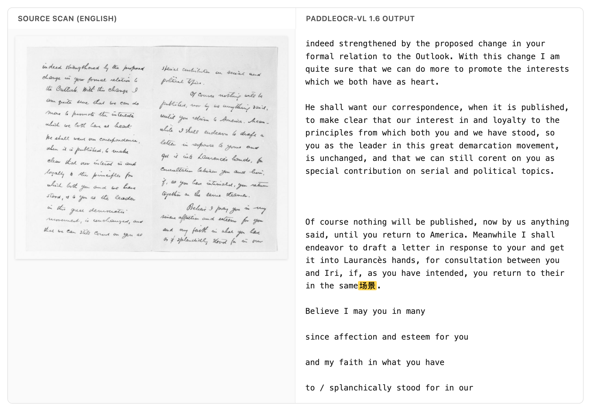

Benchmarking OCR fairly is hard. I ran ten newer OCR models on the `old_scans` subset of [olmOCR-bench](https://huggingface.co/datasets/allenai/olmOCR-bench) — 98 degraded Library-of-Congress scans, typewritten letters and carbon copies and faded stamps — and the ranking flips depending on one thing: whether you want a model that keeps what's on the page, or one that cleans it up.

It's worth saying what these models are mostly *for*. Most of the current OCR and document models are built to turn a scanned page into clean, reading-order text — the kind of text you'd feed to a language model as training data. That purpose is baked into how they get scored, and it turns out to matter a lot for how they rank.

Take two of them. On the benchmark's headline score, PaddleOCR-VL edges out NuExtract3 — 38.6 to 37.8. But rank the same two models by how much of the page they actually read, and NuExtract3 is well ahead — 41.6 to 31.2. Same two models, opposite order, depending on what you measure. I found that surprising, and working out why meant looking at what the headline score is actually made of.

So it's worth a quick word on the benchmark itself. Rather than score OCR with a single similarity number, olmOCR-bench runs a set of small, unit-test-style checks over each page: is this particular bit of body text *present*, is this piece of boilerplate *absent*, does this line come before that one. A model's score is just the share of those checks it passes. The `old_scans` subset is the hard end of it — 98 historical scans where the print is faded, skewed, or typed on an old machine, with no clean digital copy to fall back on.

## The models, ranked

| Model | params | old_scans | present | absent | order | no-halluc |
|---|---|--:|--:|--:|--:|--:|
| olmOCR-2 | 7B | **46.8** | 45.5 | 91.4 | 31.1 | 100.0 |
| LightOnOCR-2 | 1B | 42.2 | **45.9** | 47.1 | 34.5 | 100.0 |
| dots.ocr | 1.7B | 41.6 | 39.1 | 81.4 | 29.9 | 96.9 |
| GLM-OCR | 0.9B | 40.5 | 36.9 | 88.6 | 27.1 | 96.9 |
| PaddleOCR-VL 1.6 | 0.9B | 38.6 | 31.2 | 95.7 | 27.7 | 84.7 |
| PaddleOCR-VL 1 | 0.9B | 38.2 | 32.3 | 95.7 | 24.9 | 88.8 |
| NuExtract3 | 4.5B | 37.8 | 41.6 | 41.4 | 30.5 | 100.0 |
| DeepSeek-OCR | ~3B | 34.6 | 27.2 | 92.9 | 23.2 | 100.0 |
| FireRed-OCR | 2.1B | 33.3 | 30.8 | 62.9 | 25.4 | 77.6 |
| Unlimited-OCR | 3.3B | 30.6 | 29.0 | 50.0 | 25.4 | 89.8 |

`old_scans` is the headline column. `present` = did the model transcribe the body text; `absent` = did it *leave out* the boilerplate the bench wants dropped; `order` = reading order; `no-halluc` = an automatic check for junk or hallucinated characters. Parameter counts are vendor-reported and approximate.

## What the score rewards

Of those three kinds of check, it's the `absent` ones that make the ranking behave oddly. They reward a model for *not* transcribing things — the letterhead, the archival stamp, the page number. So a model that reads the page more faithfully, keeping all of that, can score **lower** than one that reads less of it but drops the boilerplate.

That's the reversal from the top. PaddleOCR-VL's layout pipeline drops the running headers and footers for free (`absent` 95.7), so it scores well even though it reads less of the body text (`present` 31.2). NuExtract3 reads more of the page (`present` 41.6) but keeps the letterheads, so the `absent` tests mark it down. The two end up with almost the same headline score while doing quite different things to the page.

It's easier to see across all ten models if you line up the headline ranking next to the ranking by transcription alone:

<figure style="margin: 1.75rem auto; text-align: center;">
<svg viewBox="0 0 680 460" role="img" aria-labelledby="flip-title" style="max-width: 640px; width: 100%; height: auto; font-family: inherit;">
<title id="flip-title">The same ten OCR models ranked by headline score versus by transcription; NuExtract3 rises and PaddleOCR-VL 1.6 falls.</title>
<text x="248" y="30" text-anchor="end" font-size="13" font-weight="600" fill="currentColor">Ranked by headline score</text>
<text x="432" y="30" text-anchor="start" font-size="13" font-weight="600" fill="currentColor">Ranked by transcription only</text>
<line x1="255" y1="70" x2="425" y2="108" stroke="currentColor" stroke-opacity="0.22" stroke-width="1"/>
<line x1="255" y1="108" x2="425" y2="70" stroke="currentColor" stroke-opacity="0.22" stroke-width="1"/>
<line x1="255" y1="146" x2="425" y2="184" stroke="currentColor" stroke-opacity="0.22" stroke-width="1"/>
<line x1="255" y1="184" x2="425" y2="222" stroke="currentColor" stroke-opacity="0.22" stroke-width="1"/>
<line x1="255" y1="222" x2="425" y2="298" stroke="#cf222e" stroke-width="2.5"/>
<line x1="255" y1="260" x2="425" y2="260" stroke="currentColor" stroke-opacity="0.22" stroke-width="1"/>
<line x1="255" y1="298" x2="425" y2="146" stroke="#1a7f37" stroke-width="2.5"/>
<line x1="255" y1="336" x2="425" y2="412" stroke="currentColor" stroke-opacity="0.22" stroke-width="1"/>
<line x1="255" y1="374" x2="425" y2="336" stroke="currentColor" stroke-opacity="0.22" stroke-width="1"/>
<line x1="255" y1="412" x2="425" y2="374" stroke="currentColor" stroke-opacity="0.22" stroke-width="1"/>
<circle cx="255" cy="222" r="3" fill="#cf222e"/><circle cx="425" cy="298" r="3" fill="#cf222e"/>
<circle cx="255" cy="298" r="3" fill="#1a7f37"/><circle cx="425" cy="146" r="3" fill="#1a7f37"/>
<text x="245" y="74" text-anchor="end" font-size="13" fill="currentColor" fill-opacity="0.8">olmOCR-2 <tspan font-size="11" fill-opacity="0.5">7B</tspan></text>
<text x="245" y="112" text-anchor="end" font-size="13" fill="currentColor" fill-opacity="0.8">LightOnOCR-2 <tspan font-size="11" fill-opacity="0.5">1B</tspan></text>
<text x="245" y="150" text-anchor="end" font-size="13" fill="currentColor" fill-opacity="0.8">dots.ocr <tspan font-size="11" fill-opacity="0.5">1.7B</tspan></text>
<text x="245" y="188" text-anchor="end" font-size="13" fill="currentColor" fill-opacity="0.8">GLM-OCR <tspan font-size="11" fill-opacity="0.5">0.9B</tspan></text>
<text x="245" y="226" text-anchor="end" font-size="13" fill="#cf222e" font-weight="600">PaddleOCR-VL 1.6 <tspan font-size="11" font-weight="400" fill-opacity="0.65">0.9B</tspan></text>
<text x="245" y="264" text-anchor="end" font-size="13" fill="currentColor" fill-opacity="0.8">PaddleOCR-VL 1 <tspan font-size="11" fill-opacity="0.5">0.9B</tspan></text>
<text x="245" y="302" text-anchor="end" font-size="13" fill="#1a7f37" font-weight="600">NuExtract3 <tspan font-size="11" font-weight="400" fill-opacity="0.65">4.5B</tspan></text>
<text x="245" y="340" text-anchor="end" font-size="13" fill="currentColor" fill-opacity="0.8">DeepSeek-OCR <tspan font-size="11" fill-opacity="0.5">~3B</tspan></text>
<text x="245" y="378" text-anchor="end" font-size="13" fill="currentColor" fill-opacity="0.8">FireRed-OCR <tspan font-size="11" fill-opacity="0.5">2.1B</tspan></text>
<text x="245" y="416" text-anchor="end" font-size="13" fill="currentColor" fill-opacity="0.8">Unlimited-OCR <tspan font-size="11" fill-opacity="0.5">3.3B</tspan></text>
<text x="435" y="74" text-anchor="start" font-size="13" fill="currentColor" fill-opacity="0.8">LightOnOCR-2 <tspan font-size="11" fill-opacity="0.5">1B</tspan></text>
<text x="435" y="112" text-anchor="start" font-size="13" fill="currentColor" fill-opacity="0.8">olmOCR-2 <tspan font-size="11" fill-opacity="0.5">7B</tspan></text>
<text x="435" y="150" text-anchor="start" font-size="13" fill="#1a7f37" font-weight="600">NuExtract3 <tspan font-size="11" font-weight="400" fill-opacity="0.65">4.5B</tspan></text>
<text x="435" y="188" text-anchor="start" font-size="13" fill="currentColor" fill-opacity="0.8">dots.ocr <tspan font-size="11" fill-opacity="0.5">1.7B</tspan></text>
<text x="435" y="226" text-anchor="start" font-size="13" fill="currentColor" fill-opacity="0.8">GLM-OCR <tspan font-size="11" fill-opacity="0.5">0.9B</tspan></text>
<text x="435" y="264" text-anchor="start" font-size="13" fill="currentColor" fill-opacity="0.8">PaddleOCR-VL 1 <tspan font-size="11" fill-opacity="0.5">0.9B</tspan></text>
<text x="435" y="302" text-anchor="start" font-size="13" fill="#cf222e" font-weight="600">PaddleOCR-VL 1.6 <tspan font-size="11" font-weight="400" fill-opacity="0.65">0.9B</tspan></text>
<text x="435" y="340" text-anchor="start" font-size="13" fill="currentColor" fill-opacity="0.8">FireRed-OCR <tspan font-size="11" fill-opacity="0.5">2.1B</tspan></text>
<text x="435" y="378" text-anchor="start" font-size="13" fill="currentColor" fill-opacity="0.8">Unlimited-OCR <tspan font-size="11" fill-opacity="0.5">3.3B</tspan></text>
<text x="435" y="416" text-anchor="start" font-size="13" fill="currentColor" fill-opacity="0.8">DeepSeek-OCR <tspan font-size="11" fill-opacity="0.5">~3B</tspan></text>
</svg>
<figcaption style="font-size: 0.85rem; opacity: 0.75; max-width: 540px; margin: 0.5rem auto 0;">The same ten models, ranked by the headline <code>old_scans</code> score (left) and by transcription alone (<code>present</code>, right). NuExtract3 climbs from 7th to 3rd once boilerplate removal stops counting; PaddleOCR-VL 1.6 slips the other way.</figcaption>
</figure>

## Whether that's the right score depends on what you're doing

This is a perfectly reasonable score if you want clean, linearised reading-order text for LLM training — which is exactly what olmOCR is built for. There, the letterhead and the page number really are noise.

But if you're doing OCR of an archive, the letterhead, the stamp, and the marginal note are often part of the record, and you'd want them kept. Under that goal the same ranking works against you: the models that "over-extract" here are the ones you'd actually want. So which of these rankings is the right one depends on what you're going to do with the text, and it's worth being clear about that before reading much into a single number.

There's a more general point here about how much detail a score gives you. Most leaderboards report one top-line number per model. Breaking that down by subset — old scans, clean print, tables, handwriting — already helps a lot if you only care about one kind of document. But you can often go a level further, as here: splitting a subset's score into what it's actually testing — did the model read the text, did it drop the boilerplate, did it get the order right — is what tells you what you're really getting. The more granular the score, the easier it is to work out whether a model fits the problem in front of you.

## A few other things I noticed

- **The bigger models don't obviously win.** On pure transcription (`present`), a 1B model — LightOnOCR-2 (45.9) — reads as much of the page as models four to seven times its size, and more than several of them.
- **PaddleOCR-VL-1.6 sometimes produces stray characters.** On some English-only scans it emits Chinese and Japanese glyphs (场, 景, 民, 生) that aren't on the page — you can see it in the no-hallucination column (84.7, against 100 for several others). I'd treat this as something to check rather than a firm result: I ran the model with its default pipeline and didn't tune it, so some of this could be down to how I ran it rather than the model itself.

- **olmOCR-2 scores highest** (46.8), which isn't very surprising — it's the model olmOCR-bench was built alongside, trained for exactly this kind of output. Even so, it gets fewer than half the checks right, a fair reminder of how hard these scans still are.

## How I ran this

The whole thing runs on the Hugging Face Hub, driven by an agent — no local GPU, and nothing done by hand. Each model is one [HF Job](https://huggingface.co/docs/huggingface_hub/guides/cli#hf-jobs) that writes its transcriptions to a shared [storage bucket](https://huggingface.co/docs/hub/storage-buckets). olmOCR-2 I [served with a single `vllm serve` command](https://huggingface.co/docs/hub/jobs-serving) on a Job with an exposed port, then hit it with an OpenAI client — using olmOCR's own prompt and 1288px render, so the model runs the way it's meant to. One CPU Job then scores every model's output together with the stock `olmocr.bench.benchmark`.

The scoring step is the part I keep coming back to. Normally, reproducing or extending a benchmark like this means sitting with a GPU: install the model, render the pages, run inference, collect the outputs, score them, then do it all again for the next model. Here, adding a model is just one more Job. I told an agent which model to run, and it launched the Job, waited for it, and re-scored everything together. Half the models in the table were already in the bucket from an earlier run, so re-scoring the whole set alongside the new ones took about a minute. Because the models, the outputs, and the scoring all live on the Hub — as Jobs and scripts rather than on my laptop — someone else can re-run this, or drop in a model I didn't try, without redoing any of the setup.

As a check that the setup measures what it should, I ran the original PaddleOCR-VL through it and got back its published old_scans figure, within the benchmark's confidence interval.

The scripts are here: [ocr-bench/experiments/olmocr-bench-oldscans](https://github.com/davanstrien/ocr-bench/tree/main/experiments/olmocr-bench-oldscans).
