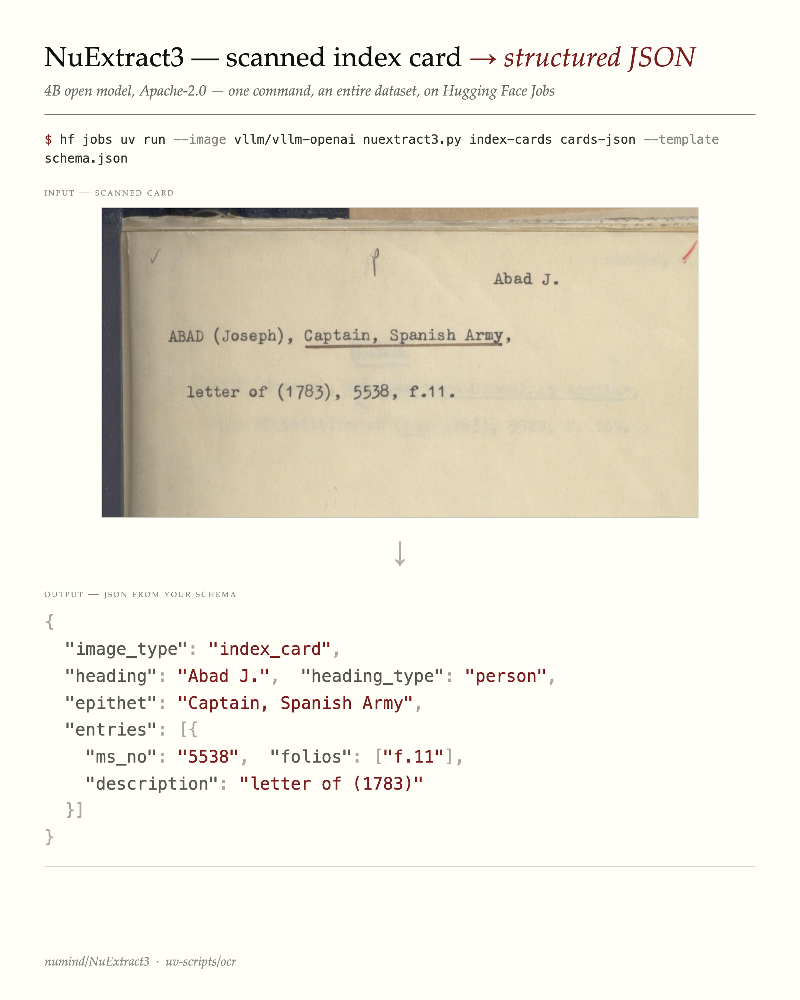
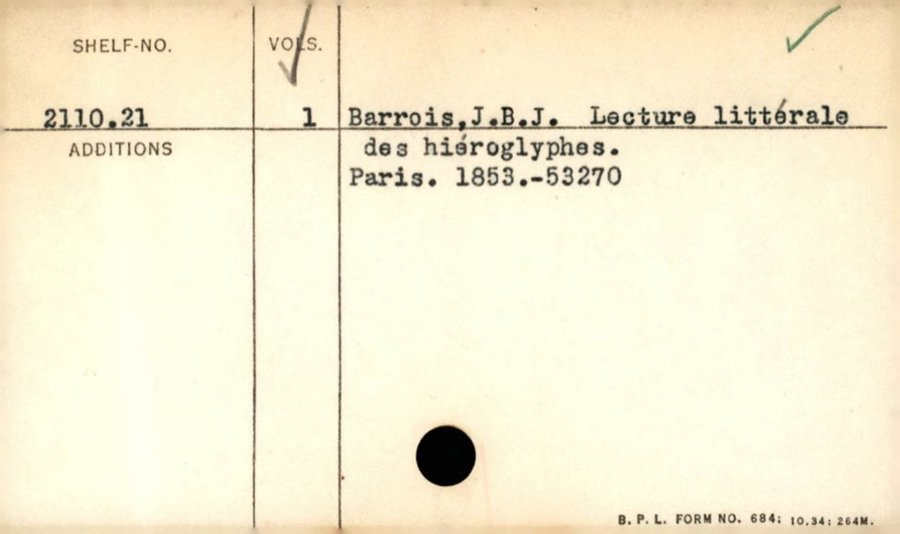

A while back I [re-OCR'd Boston Public Library's card catalogue](../bpl-card-catalog/index.qmd):  453,000 cards, $39, turning blurry decade-old OCR into clean, searchable text. That helps fix *search* but it didn't fix the thing libraries actually need.

A catalogue card isn't really free text. It's a structured record — a heading, a shelfmark, an author, a title, a date, an accession number laid out in a format a cataloguer designed. Libraries want that **structure** back, because structured fields are what can be put into their catalogue systems. Clean markdown is searchable; it isn't ingestible.

So the question is no longer "can we read the card?" It's "can we turn the card into a *record*?"

## Schema in, JSON out

[NuExtract3](https://huggingface.co/numind/NuExtract3) (4B parameters, Apache-2.0) does exactly this. You hand it an image **and a JSON template describing the fields you want**, and it returns JSON matching that shape. No markdown to post-process — structured data directly.

Here it is on a card from the National Library of Scotland's Advocates Library manuscript index ([public dataset](https://huggingface.co/datasets/NationalLibraryOfScotland/nls-index-cards-object-detection)):

{width=82%}

The template is the interesting part. Its leaf values *declare the field types* — `verbatim-string` (extract exactly as written), `string` (allow light normalisation), arrays for repeating fields, enums for fixed choices. The model fills in the shape:

```json
{
  "image_type": ["index_card", "verso", "cover", "blank", "other"],
  "heading": "verbatim-string",
  "heading_type": ["person", "family", "corporate", "geographic", "subject"],
  "epithet": "string",
  "entries": [
    {"ms_no": "verbatim-string", "folios": ["verbatim-string"], "description": "string"}
  ]
}
```

That schema is specific to *this* collection. A different card series wants a different shape — and you just write a different template. Here's the one I used for BPL shelf-list cards:

```json
{
  "card_type": ["bibliographic", "shelf_divider", "other"],
  "shelf_no": "verbatim-string",
  "author": "verbatim-string",
  "title": "verbatim-string",
  "place_of_publication": "verbatim-string",
  "date": "string",
  "accession_no": "verbatim-string",
  "volumes": "string",
  "additions": "string"
}
```

This matters for the ingest problem: the schema can be shaped to match what a particular catalogue expects, rather than forcing the library to adapt to the model's output.

## One command

The whole thing runs as a single command on Hugging Face Jobs — no GPU of your own, no setup — using the [`nuextract3.py`](https://huggingface.co/datasets/uv-scripts/ocr) UV script:

```bash
hf jobs uv run --flavor a100-large \
    --image vllm/vllm-openai:latest \
    --python /usr/bin/python3 \
    -e PYTHONPATH=/usr/local/lib/python3.12/dist-packages \
    -s HF_TOKEN \
    https://huggingface.co/datasets/uv-scripts/ocr/raw/main/nuextract3.py \
    my-cards my-records \
    --template schema.json
```

Point it at a dataset of card images, hand it a schema, get a dataset of structured records back.

## A live demo

I ran a sample of BPL shelf-list cards through it. The output is a browsable page — card image next to the extracted record:

**[→ Live demo: BPL shelf-list cards → structured records](https://huggingface.co/spaces/davanstrien/bpl-shelf-list-extraction)**

A typical result, zero-shot:

{width=62%}

```json
{
  "card_type": "bibliographic",
  "shelf_no": "2110.21",
  "author": "Barrois, J.B.J.",
  "title": "Lecture littérale des hiéroglyphes.",
  "place_of_publication": "Paris",
  "date": "1853",
  "volumes": "1",
  "accession_no": "53270"
}
```

The model also self-tags the shelf-*divider* cards (the printed 00–99 grids) so they can be filtered out — useful, because a real digitised collection is full of dividers, blanks and versos you don't want to run an extractor over.

## How good is zero-shot, really?

Genuinely good — with caveats worth being honest about.

On [DOAB](https://huggingface.co/datasets/biglam/doab-metadata-extraction) (open-access books with MARC ground truth), NuExtract3 zero-shot off a single title-page image got **100% title and 94% publisher** on a 50-book sample. For comparison, general vision-language models on a similar born-digital metadata task scored roughly 77% (a 4B model) to 86% (a 35B model).

The honest footnotes: that's not a perfectly controlled head-to-head — the comparison points come from a *different* corpus, the title match credits a title with-or-without its subtitle, and the model was working from one page where the older baselines saw several. So: a strong directional signal that zero-shot structured extraction is now genuinely useful, not a benchmark trophy. On harder material — handwritten or heavily annotated cards — there's real headroom, and the BPL demo above is unreviewed.

## Why this is the interesting part

Better OCR was the easy win. The harder, more valuable one is structured records: data a library can actually ingest, in a schema it controls. With a 4B open model and one command, that's now within reach of any institution with a folder of card images — no ML team required.

The realistic path isn't "model spits out perfect MARC." It's: zero-shot first pass → a curator reviews a sample → iterate the schema → and, where it pays off, a small fine-tuned model for a specific collection. Card catalogues are a problem nearly every library and archive shares, which makes them a good candidate for building something reusable rather than one-off.

---

*Cards: Boston Public Library (public domain) and the National Library of Scotland Advocates Library ([public dataset](https://huggingface.co/datasets/NationalLibraryOfScotland/nls-index-cards-object-detection)). Model: [numind/NuExtract3](https://huggingface.co/numind/NuExtract3). Script: [uv-scripts/ocr](https://huggingface.co/datasets/uv-scripts/ocr).*
