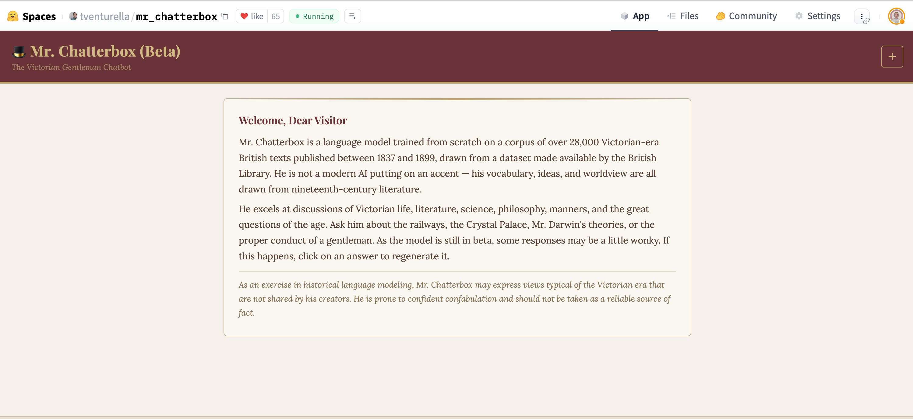
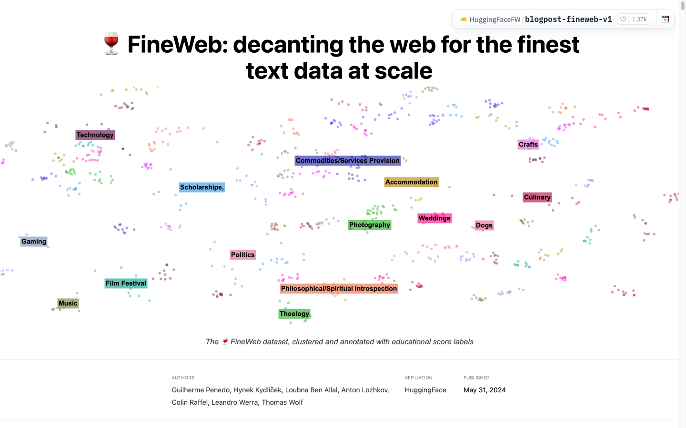

## {background-image="images/bus-meme.jpg" background-size="contain" background-color="#111111"}

::: {.notes}
Open on the meme. It's the whole talk in one image: not building your own infrastructure can feel like despair or like freedom, depending on how you frame it. Get the laugh, then say "let me make the case for the guy on the right."
:::

## Hello

- **Daniel van Strien** — Machine Learning Librarian @ Hugging Face
- Background in libraries, archives, computational humanities
- Communities: [BigLAM](https://huggingface.co/biglam), [Small Models for GLAM](https://huggingface.co/small-models-for-glam)

::: {.notes}
20 seconds. I work on making the Hub a good home for cultural heritage data. HF is a sponsor here, but this is not a sales pitch, and the argument lands on community, not platform.
:::

# There *is* technical infrastructure {background-color="#34495E"}

## And you mostly don't have to build it

Most of this already exists:

- **Storage** for very large datasets (Xet, Buckets)
- **Compute** you rent by the minute (Jobs)
- **Hosting and a viewer** for data anyone can browse

. . .

Lots of options: commercial cloud, the European Cloud for Heritage Open Science, the data space for Cultural Heritage, the Hub.

::: {.notes}
Acknowledge the obvious reading of "infrastructure" first: servers, storage, compute. It exists. The session brief names some of these. That's the easy part.
:::

## So what should a GLAM lab actually build? {.smaller}

Building infrastructure is hard. **Maintaining** it is harder.

. . .

Is it worth building your own platform to host 100 TB datasets?

. . .

Where does *your* effort actually add something no one else will?

. . .

Preservation might be the exception, where keeping your own copy matters. For most things, use what already exists.

::: {.notes}
Pose this as a real question to the room, not a conclusion. I'm not saying never build. Preservation is the case where control is the point. But a small lab rebuilding a storage backend, a compute scheduler, or a 100 TB hosting platform is spending its scarcest resource on the least differentiated thing. Ask the room where their effort actually adds something unique.
:::

# "But — don't depend on commercial platforms" {background-color="#34495E"}

## The objection I expect from this room {.smaller}

. . .

My honest answer: **government-funded is not a safe bet in 2026 either.**

. . .

> The [Data Rescue Project](https://www.datarescueproject.org/) exists to preserve public data at risk of disappearing.

::: {style="text-align: center;"}
**Why does it need to exist?**
:::

. . .

- Where the funding comes from doesn't guarantee it will last
- Commercial and public infrastructure can both disappear

::: {.notes}
Name the objection directly. This audience is rightly wary of lock-in. Rather than assert a specific claim, point at the Data Rescue Project: a volunteer effort preserving at-risk public and government data (health, climate, historical records), working with the Internet Archive and universities. Let the room answer "why does it need to exist?" themselves. "Commercial = risky, government = safe" doesn't hold; we have just watched public infrastructure become precarious.
:::

## What actually keeps things safe {.smaller}

**LOCKSS** — Lots Of Copies Keep Stuff Safe.

. . .

What actually helps:

- **Open formats** (Parquet, ALTO/IIIF, not a vendor's database)
- **Portability**, so your tools run anywhere
- **Many copies**: your repo, the Hub, a partner, local disk

. . .

Use good infrastructure, but don't rely on only one. Commercial or public.

::: {.notes}
This is the reframe. The question isn't "which host do I trust forever", because there is no such host. The question is "if any one host vanishes tomorrow, can I move?" Open formats plus many copies make the host swappable. That's the actual sustainability strategy.
:::

## A note: agents are becoming infrastructure too

The way we build is changing too.

. . .

AI agents can now do a lot of the building work themselves.

. . .

So the hard part isn't really the building. It's having the data, and the people who know how to make it.

::: {.notes}
Keep this brief, 20 seconds. Just flag it. It connects to the next section: if building is getting cheaper, the scarce thing isn't the servers or the code, it's the data and the people who know how to make it.
:::

# Infrastructure isn't just servers {background-color="#34495E"}

## My actual argument

**Collaboration and shared datasets, for evaluation and for training, are infrastructure.**

. . .

They have a **long tail of plausible benefit**: you can't predict who will reuse them, or how.

. . .

So fund and maintain them like anything else you depend on.

::: {.notes}
This is the heart of the talk. A shared, well-documented dataset or benchmark keeps paying off for years, in ways the people who built it never anticipated. That is what "infrastructure" means. We just don't usually count it.
:::

## You never know what it will be used for {.smaller}

In 2022 I put **~25 million pages** of digitised British Library books on the Hub, through BigLAM.

. . .

Four years later, someone trained a **Victorian chatbot** from scratch on them.

. . .

The Europeana Newspapers dataset turned up inside **German Commons**, a 154-billion-token German-language dataset.

. . .

Put data somewhere people can find it, and they build things you never imagined.

::: {.notes}
The concrete proof of the "long tail". These are real, public, and mine: the BL books upload was one of my first HF PRs, and the Victorian-chatbot reuse came four years later (Ethan Mollick shared it; ~13k impressions on the post). The Europeana → German Commons example shows the same thing at national-corpus scale. I could not have predicted either. That unpredictability is the whole point: discoverability is the bottleneck, not the data.
:::

## Mr. Chatterbox, built from those books {.smaller}

{width="74%" fig-align="center"}

[huggingface.co/spaces/tventurella/mr_chatterbox](https://huggingface.co/spaces/tventurella/mr_chatterbox)

::: {.notes}
The payoff: a real, running Hugging Face Space, a language model trained from scratch on ~28,000 Victorian British Library texts (1837–1899). I did not build this; someone found the data and made it. That's the long tail, live.
:::

## How do you know a model is working?

For libraries, this is mostly an open question.

. . .

Does this OCR model read 18th-century print? Handwriting? Gaelic? Your catalogue cards?

. . .

There's usually **no benchmark** that tells you. Shared **evaluation sets** for real collections are themselves infrastructure.

::: {.notes}
The missing picture I most want to land. Everyone asks "which model should we use?", but libraries have almost no way to answer "is it any good on OUR material?" Generic benchmarks don't cover early-modern print, handwriting, minority languages, or card catalogues. Building shared eval sets for real collections is unglamorous and high value, and it is exactly what collaboration can produce.
:::

## FineWeb: the pattern, in public

{width="60%" fig-align="center"}

A **15-trillion-token** open dataset. What made it good was **evaluation**: train small models, run benchmarks, keep what helps. Open data, open recipe, open evals.

::: {.notes}
FineWeb is the public proof that a big shared dataset — with the recipe and the evaluations open — becomes infrastructure others build on. Tie back to the eval slide: they didn't guess at quality, they measured it.
:::

## FineBooks: the same bet for libraries {.smaller}

A FineWeb-style effort for digitised library collections. Still early.

> Not one big corpus, but a **series of reusable artifacts**: tools libraries can run, example datasets, small models. The corpus emerges from **adoption**, not central control.

. . .

Already doable: re-OCR'd *Britannica* (1771), 2,724 pages, for **~$5**.

[Libraries as training data](https://danielvanstrien.xyz/posts/2025/who-benefits-rethinking-library-data-ai/libraries-as-training-data.html#finebooks-a-concrete-starting-point)

::: {.notes}
Keep FineBooks vague — it's an idea / work in progress, not a product to demo today. The Britannica number is public and shows the approach is cheap and real. The quote is from my own blog.
:::

## It already works

This already happens:

- **FineWeb-C** — 500+ contributors, 58,000+ annotations, **122 languages**
- **BigLAM** — 55+ institutions
- **Data is Better Together** · reasoning-dataset competition (150+)

. . .

With shared data and shared benchmarks, labs can choose tools based on evidence.

::: {.notes}
These are real numbers from real community efforts. When you make the dataset the shared thing, lots of small institutions can each contribute a little and all benefit a lot. That's the multiplier no single lab's budget can buy.
:::

## You learn to build, not just use

Building a shared dataset teaches you how AI actually works.

. . .

For GLAM labs, that understanding matters more and more.

. . .

And it stays with your staff, even when funding or platforms change.

::: {.notes}
The act of building is capacity-building. A lab that has co-built a training or eval dataset understands data quality, model limits, and provenance in a way that using a chatbot never delivers. That know-how survives funding cuts and platform changes.
:::

# So {background-color="#34495E"}

## Where to put your effort

- Rent servers, storage and compute. Keep your data **portable**
- Build **shared data and benchmarks** together
- The lasting part is the **people and what they learn**

. . .

::: {style="font-size: 1.4em; text-align: center;"}
Infrastructure is the friends you made along the way.
:::

. . .

Pick one dataset or benchmark, and build it with another institution.

::: {.notes}
Land the silly title as the real conclusion. Close on the concrete ask: pick one shared dataset or benchmark and build it with someone. That's the most durable infrastructure investment a resource-limited lab can make. (Plenty here to feed the session's discussion and the blog write-up.)
:::

## Thank you

- These slides: *danielvanstrien.xyz/slides/glam-labs-futures-2026*
- [BigLAM](https://huggingface.co/biglam) · [Small Models for GLAM](https://huggingface.co/small-models-for-glam)
- [Libraries as training data](https://danielvanstrien.xyz/posts/2025/who-benefits-rethinking-library-data-ai/libraries-as-training-data.html)

**Daniel van Strien** · Machine Learning Librarian, Hugging Face

::: {.notes}
Stop on time. Hand to the insight-gathering or the next talk.
:::
